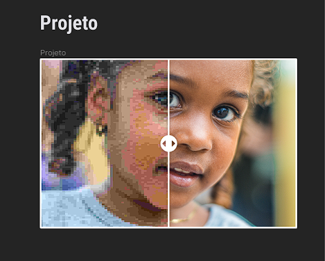

<h1 align="center">Desafio 29 - Imagem com IA</h1>

.  

  <a href="#-tecnologias">Tecnologias</a>&nbsp;&nbsp;&nbsp;|&nbsp;&nbsp;&nbsp;
  <a href="#-projeto">Projeto</a>&nbsp;&nbsp;&nbsp;|&nbsp;&nbsp;&nbsp;
  <a href="#-layout">Layout</a>&nbsp;&nbsp;&nbsp;|&nbsp;&nbsp;&nbsp;
  <a href="#-aprendizado">Aprendizado</a>&nbsp;&nbsp;&nbsp;|&nbsp;&nbsp;&nbsp;
  <a href="#-licença">Licença</a>

  

 

  

---

## 🚀 Tecnologias

Esse projeto foi desenvolvido com as seguintes tecnologias:

- HTML e CSS
- Javascript
- Chat GPT
- Git e Github
- Figma 
 
---

## 💻 Projeto

O 29º desafio proposto pela Rocketseat consiste na criação de um layout de IA, que transforma as imagens.

---
## 🔖 Layout

Você pode visualizar o layout do projeto através [Desse Link](https://www.figma.com/file/V2z6z9mnx8RwPVjGfS2aF9/Antes-e-depois-com-IA-%E2%80%A2-Desafio-29-(Community)?node-id=3%3A376&mode=dev). É necessário ter conta no [Figma](https://figma.com) para acessá-lo.

---
## 📑 Aprendizado

Durante o desenvolvimento desse projeto utilizei o Chat GPT para agilizar o processo de criação da Web Page.  
Utilizei o CSS com as positions relative e absolute, aspect-ratio e para criar e estilizar o slider.  
O Javascript foi usado para adicionar os eventos de arrastar do dragger/slider.

---

## 📝 Licença

Esse projeto está sob a licença MIT.

---

Feito com ♥ por Gustavo Zamai